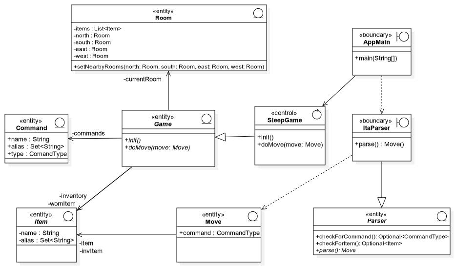

# SLEEPGAME

1. **IDEA ALLA BASE DEL PROGETTO**

   - SleepGame nasce dall'idea di unire il periodo storico in cui ci troviamo ad un nostro caro amico che ha l'abitudine di addormentarsi ovunque in pochissimi minuti.

   - Così abbiamo unito l'utile al dilettevole ed è nato sleepGame

   - l'utente si troverà nel suo stesso sogno, nel quale crederà di essere sveglio fino a che non guarderà la tv in salotto dove riceverà tutte le informazioni e leggerà tutti i bigliettini presenti nella casa.

   - qui troverà cose strane come una mosca con dieci occhi, il cielo, un gatto un po' strano nell'ingresso ed altro

   - l'obiettivo del giocatore sarà quello di trovare i quattro oggetti che nel momento in cui verranno recuperati diventeranno un unico oggetto il quale gli permetterà di completare l'avventura svegliandosi dal sogno.

     

2. **PRESENTAZIONE ARCHITETTURA DEL SISTEMA**

   Nel nostro sistema è possibile distinguere 3 componenti principali:

   - uno che gestisce la comunicazione con l'utente.
   - uno che si occupa di decodificare l'input dell'utente ed individuare la corrispondenza con una mossa
   - uno che gestisce lo stato della partita ed effettua la mossa decodificata

    Grazie a questa suddivisione è stato facile individuare quali classi sarebbero state necessarie per il nostro progetto e che lavoro nello specifico avrebbero dovuto eseguire.

   Il componente che si interfaccia con l'utente, cioè la classe AppMain, comunica con la classe ItaParser, inviando a quest'ultima la mossa ricevuta da command line, decodificandola attraverso il metodo parse.
   Quest'ultima decodifica la mossa individuando un comando ed eventualmente un oggetto su cui eseguire la mossa ignorando eventualmente congiunzioni tra le due.

   Ritorna quindi una mossa ad AppMain che richiama doMove() appartenente alla classe SleepGame di controllare di che tipo di mossa si tratta e di eseguirla. 

   Grazie all'ereditarietà per estensione utilizzando le classi astratte ci è stato possibile creare delle classi "base" da utilizzare per eventuali giochi futuri differenti da SleepGame, o ad esempio realizzare il gioco SleepGame con una lingua differente creando una classe che estende da Parser.

   

3. **DIAGRAMMA DELLE CLASSI**

   

   

4. **DETTAGLI IMPLEMENTATIVI**

   Per noi l'implementazione del metodo doMove() in SleepGame è stata molto importante perchè con essa è stato possibile permettere al giocatore di muoversi e compiere le varie azioni su gli oggetti.

   Questo metodo riceve una mossa decodificata da ItaParser contenente : il tipo di mossa da effettuare e un'eventuale oggetto su cui eseguirla.

   Perciò è stato diviso in tre sezioni principali :

   - la prima sezione si occupa dell'eventualità in cui il tipo di mossa sia nulla. In questo caso si avrà un messaggio di errore;

   - la seconda si occupa del caso in cui riceveremo solo un comando (senza un oggetto), potremo quindi solo muoverci da una stanza all'altra nel momento in cui nella direzione definita dal comando vi sia una stanza, osservare nella stanza in cui ci troviamo ricevendo la descrizione dettagliata della stanza, oppure guardare la mappa della casa da noi creata;

   - la terza si occupa dell'eventualità in cui in input abbiamo sia un comando , che un oggetto su cui effettuarlo. In questo caso ogni comando avrà un suo tipo di controlli e modo per essere effettuato. 

   

5. **SPECIFICA ALGEBRICA : LISTA** 

   **SPECIFICA SINTATTICA**

   *SORTS:* list, item, boolean, position

   *OPERATIONS:*

   creaLista( )	-> list

   fineLista(list, position)	-> Boolean

   leggiLista(list, position)	-> item

   scriviLista(list, position, item)	-> list 

   insLista(list, position, item)	-> list

   cancLista(list, position)	->list

   primolista(list)	->position

   succLista(list, position)	->position

   precLista(list, position)	-> position

   ​                                    				   **Costruttori di l’**

   | OSSERVATORI           | creaLista() | insLista(l,p,i)                                           |
   | --------------------- | ----------- | --------------------------------------------------------- |
   | fineLista(l’,p’)      | true        | false                                                     |
   | leggiLista(l’,p’)     | errore      | If p = p’ then i else   leggilista(l, p’)                 |
   | scriviLista(l’,p’,i’) | errore      | If p = p’ then i = i’ else scrivilista(l,  p, i’)         |
   | cancLista(l’,p’)      | errore      | If p = p’ then l else   insLista(cancLista(l,  p’), p, i) |

   ​                         																										                       															**Costruttori di p’**

   | OSSERVATORI      | Primolista(l) | succLista(l,p)                |
   | ---------------- | ------------- | ----------------------------- |
   | precLista(l’,p’) | errore        | If l  = l’ then p else errore |
   
   

   **SPECIFICA SEMANTICA :** 

   declare:    l,l’: list,   p,p’: position,    i,I’: item

   fineLista(creaLista( ), p’) = true

   finelista(insLista(l, p, i), p’) = false

   leggiLista(insLista(l, p, i), p’) = if p = p’ then i else leggiLista(l, p’)

   scriviLista(insLista(l, p, i), p’, i’) = if p = p’ then i = i’ else scriviLista(l, p, i’)

   cancLista(insLista(l, p, i), p’) = if p = p’ then l else insLista(cancLista(l, p’), p, i)

   precLista(l’, succLista(l, p)) = if l = l’ then p else errore

    

   **SPECIFICA DI RESTRIZIONE**

   leggiLista(creaLista( ), p’, i’) = errore

   scriviLista(creaLista( ), p’, i’) = errore

   cancLista(creaLista( ), p’) = errore

   precLista(l’, primolista(l)) = errore

   

6. **ESEMPIO LIVE**

   
